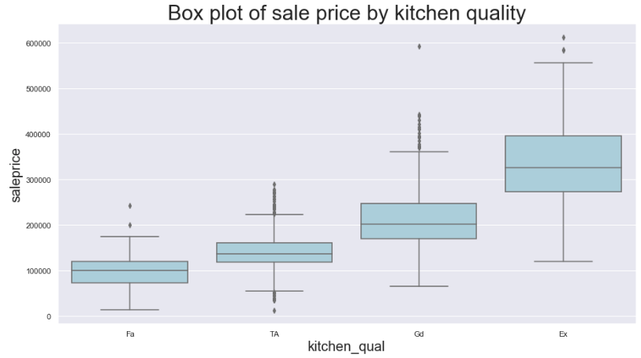

# Project 2 - Ames Housing Data and Kaggle Challenge

## Executive Summary

### Problem Statement: 
According to Dave Ramsey, America's trusted voice on money, house flipping is when a real estate investor buys houses and then sells them for a profit. However, in order for a house to be considered a flip, it must be bought with the intention of quickly reselling. The time between the purchase and the sale often ranges from a couple months up to a year. For individuals interested in flipping a house in Ames, Iowa, what features deserve the most attention? Flipping a house entails buying a house and within a short amount of time renovating the house and selling it back for a profit. Among the features that are within the control of an individual looking to flip the recently purchased house, I suggest that the individual invest their limited time and resources in the kitchen, basement and the exterior quality in that order as when each category is deemed excellent, sale price of a house increases by 5,200, 4600, and 4200, respectively. By improving the three separate features, one can expect that the overall quality of the house to increase, thereby helping the sale price to increase when selling the house back for a profit.  
(source: https://www.daveramsey.com/blog/how-to-flip-a-house)

### Description of Data:
The data used through this analysis was provided via a Kaggle competition regarding more than 70 columns that describe a particular house's qualities including but not limited to basement square feet, lot area, overall house quality, screen porch area and more.    
**Data source:**  
https://www.kaggle.com/c/dsi-us-6-project-2-regression-challenge/data

### Target 
Primary focus throughout this project was to gain experience in modeling different types of regression techniques such as linear regression, ridge and lasso. In such process of choosing our best model, feature engineering and feature selection practices were explored to provide better recommendations.

### Model Coefficients
| feature | weight |
| --- | --- |
| gr_liv_area | 2.75e+04 |
| overall_qual | 1.63e+04 |
| total_bsmt_sf | 7.89e+03 |
| garage_area | 7.72e+03 |
| bsmtfin_sf_1 | 6.97e+03 |
| year_built | 6.01e+03 |
| kitchen_qual_Ex | 5.23e+03 |
| bsmt_qual_Ex | 4.61e+03 |
| neighborhood_NridgHt | 4.56e+03 |
| exter_qual_Ex | 4.20e+03 |
| overall_cond | 3.84e+03 |
| bsmt_exposure_Gd | 3.76e+03 |
| functional_Typ | 3.58e+03 |
| ms_zoning_RM | -3.35e+03 |
| neighborhood_Edwards | -2.88e+03 |

 
RMSE plot: The distance between the blue points and red line represent the errors/residuals of the predictions from my lasso model and actual saleprices. My model predicts well for homes until 300,000, but when homes reach the above 300,000 my model tends to under-predict.

## Conclusions and Recommendations
From my lasso model, I suggest that someone who wants to flip a house purchase a home and invest their time and resources in the following order: kitchen, basement and exterior qualities. Kitchens deemed excellent increases the saleprice by approximately 5,200 USD. Investors can install countertops, new appliances and countertops. Next, excellent quality basements deem a premium of 4,600USD to the sale price. Finally, external features improvements follow a similar narrative as external qualities deemed excellent increase the sale price by 4,200. Investors should consider installing exterior motion-senser lighting which is one of the most wanted outdoor features according to National Association of Home Builders (NAHB). It also plays the role of a a safety feature for your home as lights turn on if any detected movement. With these three fixes, the price of a home can increase up to $15,000.

 
 
The investor can explore installing new countertops, new appliances and cabinets. It is evident that in this boxplot comparing kitchen quality to sale price that as quality increase, so does sale price.

 
 
The investor can explore finishing the basement (if any any part of basement is unifinished), and improving air quality. It is evident that in this boxplot comparing basement quality to sale price that as quality increase, so does sale price.

 
The investor should spend remaining resources on the exterior quality of the home such as installing outdoor motion sensitive lights which is one of the most wanted outdoor features according to National Association of Home Builders (NAHB). It is evident that in this boxplot comparing exterior quality to sale price that as quality increase, so does sale price.

### Next Steps:
Conducting an additional linear regression model on kitchen quality, basement quality and external qualities to overall quality may have provided a more tenable conclusion. Other methodologies such as grid search may provide a more efficient way to choosing a model that best fits and describes the ames datset.